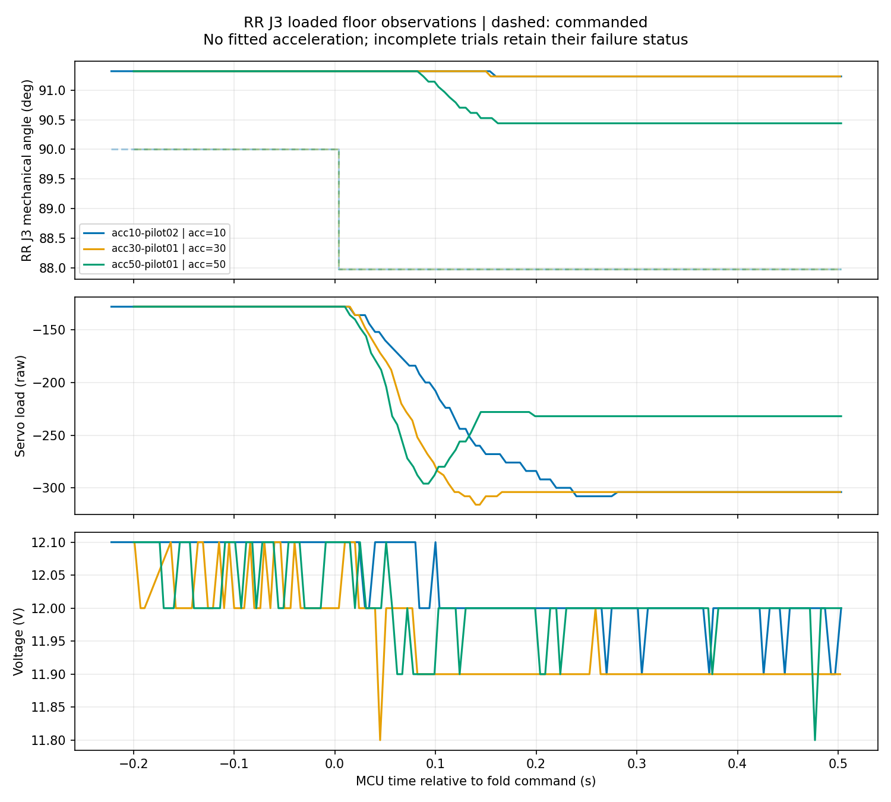

# RR J3 바닥 응답 시험 (2026-09-16)

> 후속 사용자 설명: Landing은 J3의 기구적 최대 접힘으로 토크 없이 유지되는
> 자세다. 아래 시험은 Stand에서 했으나 실제 접힘 방향과 기구 여유를 독립
> 확인하지 못했다. 원시 목표/측정 기록은 보존하며 ‘접힘 성능’으로의 해석은
> 보류한다. 현재 Landing의 끝점이 당시 미달 원인이었다고 확정하지 않는다.

**실제 가속도 값은 아직 식별하지 못했다.** 같은 작은 목표를 줬을 때 바닥 지지
상태에서 J3의 운동이 매우 작았고, 모든 시험은 복귀 전에 도착 조건 미달로 중단됐다.
부하 원시값 상승을 함께 관측했다. 가속도 설정 외에 접지 하중·마찰·기구 연동과
서보 제어 특성이 섞인 결과이며, 보행 문제가 해결됐다는 뜻은 아니다.

## 조건과 기록

실물 v75, V6.2.6 Stand, 사용자가 네 발 접지/몸체를 들지 않음/전도 대비 확인.
RR J3(ID12) 원래 목표1022, 실측1007. 목표를1045로 변경(−2.021° 기구각),
500ms 관측. 다른11축의 목표는 유지했다. 속도3400, ACC10/30/50 readback 확인.
실행 순서10→50→30, 각1회. 조회 시각은 STM32 버스 요청/응답 구간이다.

| ACC | 관측 이동량 | 0.264° 이동 첫 관측 구간 | 마지막 목표 오차 |
|---|---:|---|---:|
|10|0.088°|없음|3.252°|
|30|0.088°|없음|3.252°|
|50|0.879°|96~104ms|2.461°|

조회 간격 중앙값5ms, 최대25~26ms. 최대 간격에는 이상 온도 표본의 재확인 시간이
포함된다. 각도 분해능은1틱=0.08789°. 내부 엔코더 표본 시각은 알 수 없다.
시뮬레이터의439deg/s²/20ms를 이 표로 검증할 수 없다. 설정별 반복 시험도 미완료다.

## 종료 및 주의할 해석

세 시험 모두 목표 오차24틱 이하 조건에 미달했다. 실패 기록을 합격으로 바꾸지 않았다.
실험 중 온도 값이 정상 약40°C에서70~150°C로 튀는 표본들이 있었고,
별도 주소63 및 전체 상태 재조회로 정상 확인된 경우에만 진행했다. 원래 표본은
보존했다. 다른 자세 복귀에서 재확인까지 이상값이 지속된 경우에는 실제로 중단했다.
보고값 불안정의 원인은 아직 확인하지 못했다.

최종 Landing 완료, 최대 오차12틱, 토크ON, safety OK. 최종 조회12축 hw=0,
31~42°C. 발 끌림 수정이나 전체 보행 시험은 진행하지 않았다.

다음 검증은 먼저 온도 보고 신뢰성을 분리하고, 추진 종료 후 J2를 이용한
하중 해제와 J3 접힘을 연결했을 때의 실제 운동을 비교하는 것이다. 현재 결과만으로
J2 선행 동작의 효과까지 입증한 것은 아니다.

원본: `trials/acc10-pilot02`, `trials/acc30-pilot01`, `trials/acc50-pilot01`.
분석: `analysis/acc10-30-50/analysis.json`, `samples.csv`.
최종 상태: `final-landing.json`.
