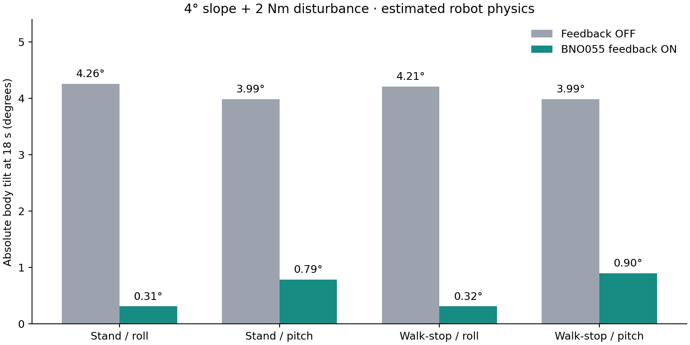

# BNO055 기반 능동 수평 보정

가상 로봇의 기본값을 IMU 관측만 하는 모드에서 능동 수평 보정으로 변경했다. iOS V0.3.2 (8) Debug에 ON/OFF와 실제 상태 표시를 추가했다. 실물 로봇에는 업로드하지 않았다.

## 제어 경로

MuJoCo 자세 → BNO055 IMUPLUS 출력 모델(100Hz, 지연·노이즈·양자화) → 실물 방식의 50Hz 정수 자세/미분 필터 → 제한된 PI+D 보정 → 실물과 공유하는 `gait_policy_balance_targets` C 함수 → 관절 목표 → 지연·가속도·토크·전압 제한을 갖는 가상 모터 → 물리적 몸체 반응.

보정기에 MuJoCo의 실제 자세나 속도를 직접 넣지 않는다. 원래 보행 목표와 보정 목표를 따로 유지하여 매 프레임의 보정이 원래 궤적에 누적되는 오류를 방지했다. 기울기 양수 방향은 로봇 우측 하강 roll, 전방 하강 pitch이다. 세계 수평을 목표로 한다. yaw/진행 방향 유지 제어는 아니다.

- 일반 보행/정지: P 0.25, D 0.015, I 0.15.
- 크롤 보행: P 0.10, D 0.005, I 0.03. 일반 보정 강도에서 발생한 12도 이상의 진동을 재현한 후 분리했다.
- 길이 보정은 C 함수의 정규화 길이 단위로 제한한다. 보행 ±0.06, 정지 ±0.12이며 **미터 단위가 아니다**.
- 관절 보정은 보행 ±6도, 정지 ±10도, 변화 속도 15도/초로 제한한다. 최종 관절 범위도 제한한다.
- 지속적인 경사/하중 오차는 제한된 적분으로 제거한다. 길이·관절 보정 포화 시 같은 방향 적분을 멈추고 반대 방향으로는 풀릴 수 있다.
- 수평 보정은 다리의 길이를 조정하며, 이번 검증에서는 J1 측면 보정과 발 착지 위치 보정은 사용하지 않는다. 따라서 지지 다리 추정에 의존하지 않으며, 공중 발에도 연속적인 몸체 높이 오프셋을 적용한다. 지형 인식이나 접촉력 분배 최적화 제어가 아니다.

## 상태·안전·앱

Stand 및 보행과 정상 정지 후 Stand 복귀에서 보정을 유지한다. Landing/Stand11/Hold, 토크 해제, 센서 읽기 오류, 기울기 안전 잠금에서는 보정을 중단하고 보정량을 부드럽게 줄인다. 센서 오류 시 적분은 초기화한다. 12도 초과 2회 또는 읽기 실패 3회는 정지 및 안전 잠금을 수행한다. 정지 중에도 감시한다. `recover` 후 문제가 계속되면 다시 잠긴다.

- `simbalance on|off`: 정지 상태에서 설정. 기본 ON.
- `syncstate`: `balance=active|suspended|off`, `caps=...,simbalance`.
- `imudiag`, `baldiag`: 측정 자세, 필터 결과, P/D/I 설정, 적분량, 실제 보정량 및 포화 상태.
- MuJoCo 화면: 센서 샘플 나이, ACTIVE/SUSPENDED, 관절 보정 최대값.
- 앱: “BNO055 수평 보정” 토글, 작동/대기/꺼짐 구분. 보행 중 설정 변경 시 먼저 정지한다. 실제 로봇 대상으로 이 시뮬레이터 전용 명령을 전송하지 않는다.

## 검증과 재현

`simulation/mujoco/check_balance_matrix.py`: 다섯 정책 × 세 물성 조건 × 네 방향/전환(60건), 센서 융합 지연 60ms 전환(5건). 안전 상태, 발 이외 지면 접촉, 정지 완료 확인. `balance_matrix.json` 참조.

`simulation/mujoco/validate_balance.py`: ON/OFF × 정지/보행 × roll/pitch × 평지/4도 경사(16건). 5초에 몸체에 2Nm 토크를 0.4초간 적용하고 18초까지 관찰한다. 자세를 강제로 바꾸지 않는다. 경사면은 XML 컴파일 시 실제 충돌 평면을 회전시킨다. `balance_validation.json` 참조.

센서·포화·전환·프로토콜 Python 테스트 및 iOS 명령·상태·실물 대상 차단 테스트를 포함한다. 실물과 공유하는 것은 C 다리 보정 함수이며, 이번에 추가한 적분·보행별 이득·상태 관리는 가상 어댑터에 구현했다. **실물 STM32 제어기 전체와 동일한 바이너리/동작이라는 의미는 아니다.**

센서 모델의 지연과 노이즈, 몸체 질량·관절 축·마찰·모터 특성은 아직 추정값이다. 시뮬레이터의 통과 결과가 실제 로봇의 무전도나 모든 지형에서 완전한 수평을 보장하지 않는다. 실물 이식 전에 정상 전원에서 축/영점, 센서 지연, 모터 응답과 무게중심을 실측해야 한다.

## 최종 결과

- Python 247개 테스트와 26개 subtest 통과, iOS 37개 테스트 통과.
- 보행·전환·지연 65건 및 경사/외란 A/B 16건 통과.
- 4도 경사에서 18초 시점의 절대 기울기: 정지 roll 4.26→0.31도, pitch 3.99→0.79도. 보행 후 정지 roll 4.21→0.32도, pitch 3.99→0.90도.
- 모든 조건에서 흔들림이 줄어든다는 의미는 아니다. 평지 pitch 외란의 일부 지표는 OFF보다 커졌으며 전체 개별 수치는 JSON에 남겼다.
- 실행 중인 MuJoCo 재시작 후 TCP에서 `balance=active`, IMUPLUS, 샘플 나이 30ms, 센서 오류 0을 확인했다.
- iPhone V0.3.2 (8) 설치 완료. 기기 잠금 때문에 원격 앱 실행은 거절되었으며, 잠금을 해제하고 앱을 열어 가상 BLE로 연결하면 된다.

후속 고속 보행 수정: 현재 보행 이득 및 제한은 [BALANCE-V3-2026-09-09.md](BALANCE-V3-2026-09-09.md)를 따른다. 이 문서의 초기 보행 이득은 사건 재현 후 교체했다.
