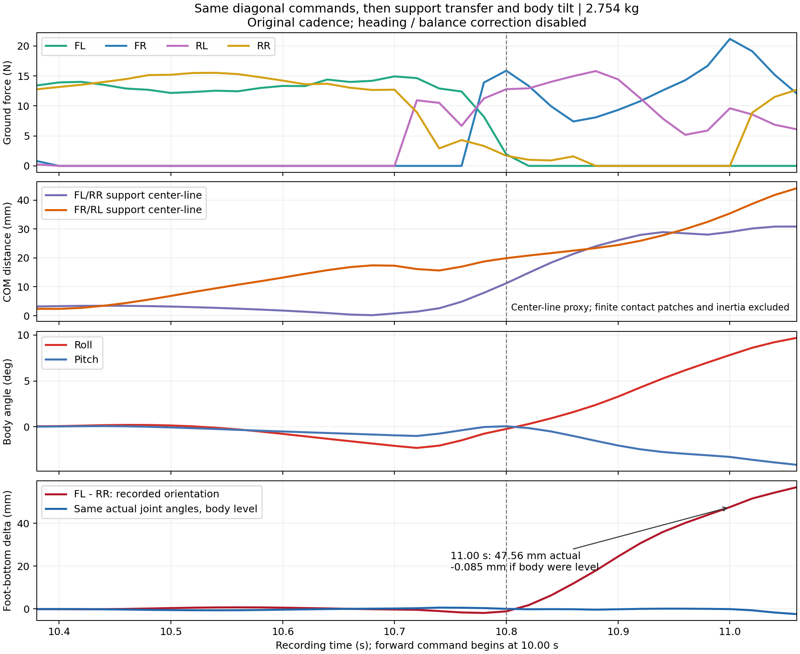
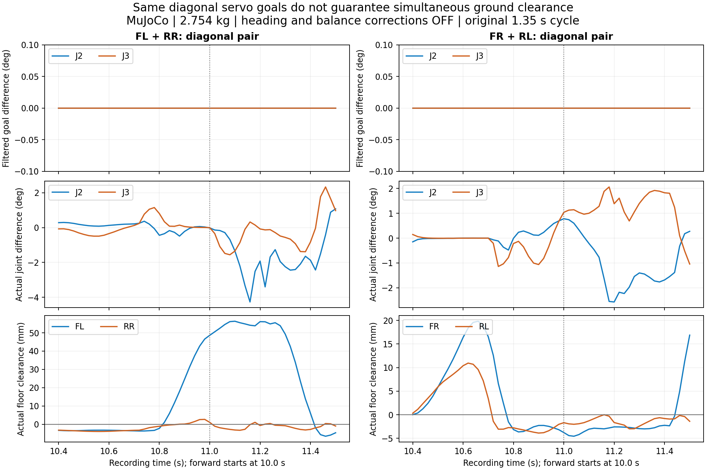

# 대각선 접촉 불일치: 원인 분리 결과

2026-09-14 · MuJoCo 분석 · 대각선 쌍 **FL/RR, FR/RL** · 실물/앱 변경 없음

현재 증거는 **대각선 명령의 시간차보다 지지 전환 시 몸체의 회전이 지면 기준 발 높이를 크게 갈라놓는다**는 것을 보여 준다. 보정 경로를 끄면 같은 쌍의 J2/J3 명령과 서보 내부 목표가 동일해도 문제가 남는다. 몸체를 고정하고 바닥 접촉을 제거하면 실제 관절 차이는 거의 사라진다. 따라서 앞서 “뒷다리 모터가 느려서”라고 설명한 것은 불완전했다.

아래는 원인을 분리하는 시험 결과이며, 보행 수정 완료나 실물 검증 결과가 아니다. 총질량 **2.754kg**은 실측값이다. 질량 분포, 서보 동특성, 쿠션 접촉 물성에는 추정값이 남아 있다.

## 1. 같은 대각선에 다른 모터 설정이 들어가는가

기준 시험은 `shoulder_j2_lift32_preview`, 주기 약 **1.35초**, duty **0.52**, 명목 발 들림 **32mm**, 10초 대기 후 전진이다.

네 다리의 같은 관절 번호에는 동일한 모델 값이 적용된다. J1/J3는 STS3215, J2는 STS3250이다.

| 항목 | J1/J3 | J2 |
|---|---:|---:|
| 속도 상한 | 4.717106rad/s | 7.873666rad/s |
| 스톨 토크 모델 | 2.941995Nm | 4.903325Nm |
| 목표 지연 | 20ms | 20ms |
| 목표 가속도 상한 | 25rad/s² | 25rad/s² |
| 추가 영점 오차 | 0° | 0° |

자세/방향 보정 OFF에서 대각선 J2/J3 실수 명령의 최대 차이는 0.000008° 미만이다. **모터 단위로 양자화한 목표, 지연 후 목표, 가속도 제한 후 목표의 대각선 차이는 모두 정확히 0**이다. 이 조건에서는 ID별 변환이나 한쪽 모터에만 다른 속도를 지정하는 오류가 원인으로 나타나지 않았다.

기존 보정 ON에서는 J3 명령 차이가 최대 **3.76°**, 내부 가속도 제한 후 목표 차이가 최대 **7.83°**이다. 기존 보정 경로와 서보 목표 필터가 차이를 추가하는 것은 별도 문제이며, 대각선 동기화 검사에서 명목 궤적만 확인하면 놓친다.

## 2. 동일한 명령으로 바닥과 몸체의 자유도를 분리했다

같은 명령·서보 모델·중력에서, 보정 OFF인 두 조건을 비교했다. 벤치 조건은 몸체를 고정하고 바닥 충돌을 명시적으로 비활성화했다. 기록된 발–바닥 접촉력이 전부 0인지도 검사했다.

| 조건 | 실제 J2 쌍 차이 RMS, FL/RR·FR/RL | 실제 J3 쌍 차이 RMS, FL/RR·FR/RL |
|---|---:|---:|
| 바닥 접촉 + 자유 몸체 | 1.359° · 1.402° | 1.049° · 1.058° |
| 몸체 고정 + 발 공중 | 0.0123° · 0.0122° | 0.00495° · 0.00498° |

서보 명령 경로 자체가 같은 쌍을 수백 ms 어긋나게 만드는 것이 주된 설명은 아니다. **지면 접촉, 하중, 몸체 자유 운동의 결합이 실제 관절과 발 높이 차이를 만든다.** 이 벤치 시험은 그 결합을 함께 제거하므로, 접촉과 관성 중 하나만을 단독 원인으로 확정하지는 않는다.

## 3. 발 높이 차이 대부분을 몸체 회전으로 설명할 수 있다

보정 OFF 기록의 실제 관절각을 CAD에 그대로 넣었다. 쿠션의 모든 정점을 회전시킨 뒤 가장 낮은 정점을 다시 골랐다. 같은 관절각에서 몸체를 수평으로 둔 경우와, 기록된 roll/pitch를 적용한 경우를 비교했다. 공통 몸체 위치와 yaw는 두 발의 높이 차이에서 상쇄된다.

| 시점 | roll / pitch | 수평 몸체에서 FL−RR 바닥 높이 차 | 기록 자세에서 높이 차 | 몸체 회전의 증가분 |
|---|---:|---:|---:|---:|
| 11.00초 | +7.817° / −3.274° | −0.085mm | +47.563mm | +47.648mm |
| 14.00초 | +8.527° / −3.731° | −0.255mm | +53.670mm | +53.925mm |

11초 실제 지면 여유는 FL **48.64mm**, RR **1.07mm**였다. 이때 다리 자체의 같은 관절 자세를 수평 몸체에 적용하면 높이 차이가 0.1mm도 안 된다. **몸체가 기울어 대각선 한쪽 발은 높아지고 다른 발은 바닥으로 내려가는 현상**이다. 순간 기하 분해는 높이 차이의 직접 원인을 설명하며, 최초 기울어짐의 원인은 다음 하중 전환 기록으로 확인한다.

## 4. 첫 지지 전환에서 어디가 어긋났는가

10.50초에는 FR/RL이 함께 떠 있고 FL/RR이 지지한다. FR/RL 지지선은 해당 두 쿠션 중심을 이은 XY 직선이며, COM은 현재 실제 관절각의 CAD 질량 중심이다.

| 시점 | 관측 상태 | FR/RL 선–COM 수직 거리 | roll |
|---|---|---:|---:|
| 10.50초 | FL/RR 지지, FR/RL 여유 5.85/5.92mm | 6.84mm | +0.151° |
| 10.68초 | FR/RL 착지 직전 | 17.42mm | −1.816° |
| 10.80초 | 하중이 FR/RL로 이동 | 19.91mm | −0.230° |
| 10.84초 | FL 하중 0, RR 약 0.9N | 21.66mm | +0.923° |
| 10.92초 | FR/RL 두 발 지지 | 25.93mm | +4.291° |
| 11.00초 | FR/RL 지지 중 몸체 회전 확대 | 35.39mm | +7.817° |

10.50초 기존 FL/RR 지지선–COM 거리는 3.17mm였다. 새 지지선으로 넘어갈 때 거리가 약 20mm로 증가한 뒤 기울어짐이 커진다. `질량×중력×거리`로 계산한 중력 모멘트 대용값은 10.80초 약 **0.538Nm**, 11.00초 약 **0.956Nm**이다. 이는 단일 관절 요구 토크가 아니다.

**지지선 거리는 쿠션 중심을 사용하는 대용 지표다.** 실제 쿠션의 유한 접촉면, 굴림, 압력 중심(COP), 마찰, 몸체 관성에 의한 지지 가능성을 완전히 계산한 결과가 아니다. 이 거리만으로 “반드시 전도” 또는 전체 동역학 실현 가능성을 판정하지 않는다. 다만 동일 명령 대조 및 회전 기하 분해와 함께, 다음 지지 쌍에 하중을 넘기는 설계가 핵심 수정 대상임을 가리킨다.

## 5. 실제 접촉 시각도 앞뒤를 따로 확인했다

접촉 정의는 발–바닥 법선력 합 **1N 초과**, 새 상태가 **40ms 이상** 지속되는 경우다. 20ms 간격 기록에서 연속 3개 표본으로 확인하고 첫 표본으로 시각을 되돌렸다. 이는 하중 해제/재접촉 기준으로, 양의 기하 여유와 완전히 같지는 않다. 주기 경계의 짧은 튀어오름을 오인하지 않도록 계획 스윙과 40ms 이상 겹치는 주 비행 구간을 선택했다. 재이륙과 미검출도 별도로 기록했다.

| 기록 | 정상 완전 주기 FL/RR·FR/RL | 뒷발−앞발 이륙 중앙값 | 뒷발−앞발 첫 재접촉 중앙값 |
|---|---:|---:|---:|
| 원본 `lift32mass` | 6 · 7 | +400 · +400ms | −140 · −100ms |
| 3.2초 주기, FF 제거 | 5 · 4 | 0 · 0ms | +220 · +220ms |
| 3.2초 주기, 최종 FF 60초 | 17 · 17 | 0 · 0ms | +160 · +180ms |

원본 정상 주기 최초 사례는 FR **11.44→12.12초**, RL **11.84→11.96초**이다. 뒷발이 400ms 늦게 뜨고 160ms 먼저 닿는다. 첫 과도기에도 FR/RL 다음 FL/RR 스윙에서 RR이 **11.00초**, FL이 **11.40초**에 닿아 이미 차이가 커진다.

느린 FF 후보는 다른 양상이다. FL/RR이 **15.60초 동시에 이륙**하지만 FL은 **16.24초**, RR은 **16.40초**에 닿는다. 앞발 조기 착지가 남는다. 같은 주기에서 FF를 제거하면 FL 첫 접촉은 16.14초이며 16.34초에 다시 뜬다. 따라서 처음 닿는 시점과 최종 착지는 구분해야 한다.

0.5N/2N으로 바꾸어도 원본 +400ms 이륙차, 최종 후보 +160/+180ms 재접촉차는 유지된다. 후보 이륙차는 역치에 따라 최대 20ms 바뀐다. 재이륙 횟수는 역치와 계획 스윙과의 최소 겹침 길이에 민감하다. 1N·40ms 이상 겹침 기준 원본 정상 주기에는 추가 비행이 없고, FF 제거 조건은 9/9주기, 최종 FF는 FL/RR 0/17·FR/RL 1/17주기에 추가 비행이 있다. 세 주요 기록의 정상 완전 주기에는 주 비행 미검출이 없었다. 시작 램프는 별도 집계하며 저진폭 때문에 이륙 미검출이 있다.

## 6. 지연을 없애면 해결되는가

진단용으로 목표 지연을 20ms→0, 가속도 제한을 25→1,000,000rad/s²로 바꾸었다. 모터 토크·속도 모델은 유지했다. 이는 실물 적용 설정이 아니다.

보정 OFF에서 최대 roll은 **10.14°→10.36°**로 개선되지 않았다. 정상 주기의 뒷발 이륙 차이는 약 400ms→100ms로 줄었지만, 첫 재접촉 차이는 여전히 220~240ms였다. 첫 FL/RR 스윙에서도 RR 11.14초·FL 11.44초로 300ms 차이가 남았다. **서보 동특성의 영향은 있지만, 지연 제거만으로 지지 전환과 몸체 안정이 회복되지는 않는다.**

## 7. 다음 수정의 정확한 대상

기본 대각선 J2/J3 궤적을 공통으로 유지하면서, **다음 발을 어디에 놓고 어떤 하중 분포에서 이전 발을 뗄지**를 먼저 계산해야 한다. 같은 자세의 발을 몸체 좌표에서 올리는 것만으로 실제 지면 여유와 수평이 보장되지 않는다.

기존 1.35초 주기에서 지지 반폭만 55/75mm로 줄인 독립 개입은 각각 11.30/11.18초에 기울기 안전 정지가 발생했다. 지지선 거리만 줄이는 수정은 채택하지 않는다. 계획된 하중 전환/착지 위치를 검증한 뒤, 잔여 오차에 한해 지연된 IMU·관절 피드백을 적용해야 한다. 대각선 명목 J2/J3, 양자화/지연/필터 목표, 실제 각도, 세계 좌표 발 높이, 접촉 시각을 계속 분리 기록한다.

추가로 주기 정상상태 LIPM 좌우 몸체 기준을 계산한 개입도 시행했다. 55/93mm 반폭에서 각각 11.96/12.52초에 정지하여 채택하지 않았다. Fourier 식의 부호는 확인했지만, 일정 높이·각운동량 변화 없음·종방향 가속도 없음의 가정과 실제 몸체 추종을 보장하지 않는다. 93mm 조건의 계획 좌우 이동은 12.947mm로 10mm 기준도 초과한다. `centroidal_lateral_reference.py`는 실패한 원인 분리 실험용 모듈이며, 전체 MPC/WBIC 또는 완성된 보행 제어기가 아니다. 식과 가정의 근거는 [MIT Underactuated Robotics의 CoP/ZMP 설명](https://underactuated.csail.mit.edu/humanoids.html)이다.

기존 FF 후보는 주기를 **1.35→3.2초**, duty를 **0.52→0.70**으로 바꾸고 몸체 보정을 덧붙인 완화안이다. 원인 해결이나 같은 속도의 성공으로 승격하지 않는다. 60초를 버텼어도 접촉 불일치가 남아 있고 자세 한계도 전부 통과하지 못했다. **실물 펌웨어/앱에 승격하지 않았다.**

## 8. 대각선 기준과 추가 개입의 판정

사용자가 요구한 앞/뒤 동기화 대상은 **FL–RR와 FR–RL**이다. 같은 쪽 FL–RL 또는 FR–RR를 묶는 것이 아니다. 기본 보행 위상은 `[0, 0.5, 0.5, 0]`이며, 비교하는 관절각은 기구의 방향/부호를 정규화한 J2/J3 좌표다. 좌우 서보의 원시 위치 숫자를 무조건 같게 쓰라는 뜻이 아니다.

상단 그래프는 양자화·지연·가속도 제한을 지난 대각선 J2/J3 목표 차이가 0임을 보여 준다. 아래 실제 관절각과 발 높이는 달라진다. 기울어진 몸체에서 두 발의 지면 높이를 맞추는 데는 서로 다른 관절 보정이 필요할 수 있으므로, **기본 파형의 동기화와 최종 보정각의 완전 일치는 구분한다.** 성공 기준에는 실제 지면 여유와 이륙·착지 시각이 포함되어야 한다.

추가로 `shared_swing_ground.py`에서 다음 하나의 개입을 독립 시험했다.

- 두 스윙 발에 같은 32mm 상승–유지–하강 스칼라를 적용한다.
- 지연된 IMU와 40ms 지연·4096단위 양자화 관절 피드백으로 지면 기준 높이를 계산한다. 지면은 반대 대각선의 계획된 지지 발로 추정하며, 실제 접촉력은 평가에만 사용한다.
- 기존 지지 관절 명령은 보존하고, 스윙 발 몸체 X/Y를 우선 유지하는 제한 CAD IK를 사용한다. 보정은 최대 6°, tick당 0.4° 이내다.
- 기준은 앞 절의 3.2초 FF 후보이며, 10초 대기 + 20초 전진을 같은 조건으로 비교했다. 정상 구간 자세 지표는 14–30초다.

| 높이 보정 gain | 최대 roll | roll RMS | 첫 착지 차이 중앙값 FL/RR · FR/RL |
|---|---:|---:|---:|
| 0, 기존 후보 | 3.680° | 1.327° | 160 · 160ms |
| 0.25 | 4.817° | 1.508° | 200 · 200ms |
| 0.50 | 6.039° | 2.054° | 220 · 240ms |

두 개입 모두 **실패**다. 실제 지지 명령은 보존됐고 X/Y 최대 잔여는 각각 0.002/0.008mm였으나, 자세와 착지 동기 모두 악화됐다. 따라서 gain을 더 키우거나 이 모듈을 기본 정책에 적용하지 않는다. 명목 스윙 높이만 맞추는 사후 보정으로 지지 전환의 동역학 문제가 해결된다는 가설을 기각한다.

최종 판정: **원인 분리는 수행했지만, 대각선 실제 착지 동기화와 몸체 수평 유지의 수정 완료 기준은 아직 통과하지 못했다.** 기존 3.2초 FF 영상 역시 완성된 보행의 증거가 아니다. 정상 센서·연속 위상에서의 제한 IK 검사와 센서 누락/Stop 처리 검사는 물리적 보행 합격과 별도로 보고한다.

이 FF 후보는 **고정 전진 실험용**이다. 명시적인 Cartesian X/Y 궤적이 기존 차등 보폭 방향 보정을 덮어쓰므로, 방향 유지나 좌우 회전까지 대각선 동기화가 구현됐다고 해석하면 안 된다. 방향 보정의 기존 J2/J3 차이는 1절에서 검사했지만, 그 경로의 실물 수정·배포는 이번 작업에 포함하지 않았다.

추가 모듈의 호스트 검사 6개는 통과했다. 공통 높이 목표, 지지 명령 보존, 관절 제한, 스윙 경계 연속성, 센서 누락·위상/명목 명령 점프, 관절 한계 부근의 복합 예외를 확인했다. 센서/참조가 무효이면 마지막 유효 명목 명령을 유지하고 추가 보정만 tick당 최대 0.4°로 감쇠한다. 이 계약은 직전 명목 명령+보정이 관절 범위 안에 있음을 전제로 검사한다. 센서 복구 후 임의 새 동작까지 검증한 범용 복구 제어기는 아니다.

최종 소스의 MuJoCo Stop 검사는 gain 0.5에서 15.92초 요청→17.08초 정지 자세 전환 시작→18.08초 Stand로 종료했고 fault는 없었다. 전환 첫 명령 변화는 0.000003° 미만이었다. **0.4°/tick은 추가 보정의 변화 제한**이다. 기본 보행/Stop 궤적까지 합한 명령 변화는 최대 2.820081°/tick이었으며, 이 시험은 기존 감속·자세 전환 호환성 검사이지 즉각적인 비상 정지 검증은 아니다. 코드 검사 통과가 위 표의 물리적 보행 실패를 바꾸지는 않는다.

## 재현 자료

- 명령 경로 및 개입: `artifacts/audits/sway-2026-09-14/causal_pipeline.py`, `causal-{original,nocorrection,bench-nocorrection,nolag-nocorrection}.json`
- 접촉 분석: `contact_event_timing.py`, `contact-event-timing.json`, `causal-contact-timing.json`
- 쿠션 정점 기하 분해 및 COM 지지선: `contact_geometry_decomposition.py`, `contact-geometry-decomposition.json`
- 비교 원본: `lift32mass.json`, `ground-ff-ablation.json`, `ground-ff-final60.json`
- 추가 실패 개입: `evaluate_shared_swing_ground.py`, `ground-shared-swing-{0.0,0.25,0.5}.json`, `shared-swing-contact-timing.json`; `invalid-boundary-v0` 파일은 경계 구현 수정 전 기록이므로 판정에서 제외한다.
- 대각선 그래프: `plot_diagonal_sync_evidence.py`, `diagonal-sync-evidence.png`

기록 시각은 영상/호스트 제어 tick 기준이며 한 표본은 20ms다. 모든 수치는 MuJoCo 관측·오프라인 CAD 계산이다. 설정 readback, 호스트 검사, 실물 위치 유지 시험, 실물 전체 동작 시험 중 **실물 시험은 이번 분석에 포함되지 않는다.**
