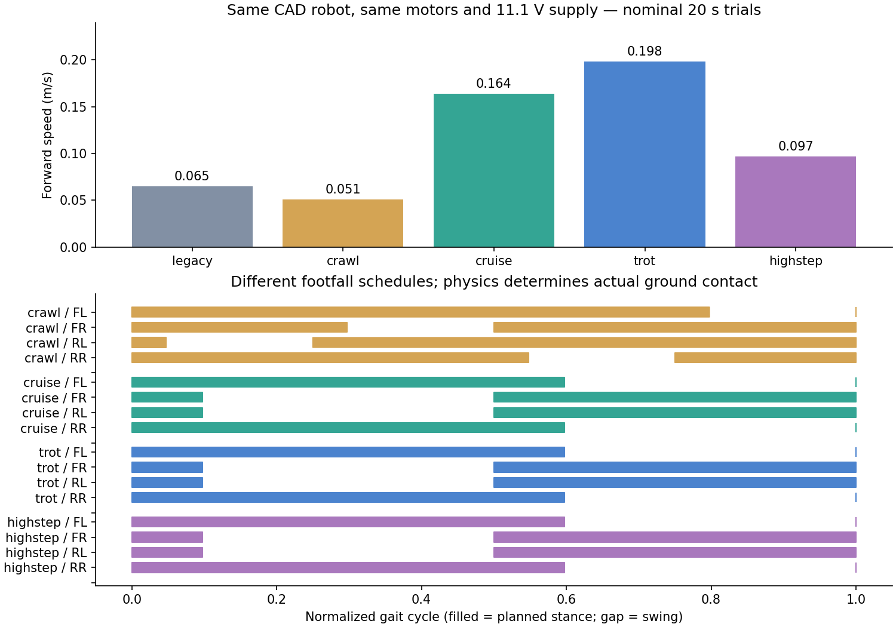

# 다양한 가상 로봇 보행 — 2026-09-09

## 반영 내용

기존 조이스틱의 1.8~2.4초 주기 보행을 비교 기준으로 유지하면서, 더 빠르고 다양한 발 디딤을
가진 **시뮬레이터 전용 정책 4종**을 추가했다. 기본값은 크루즈이다.
MuJoCo GUI와 앱 조이스틱에서 같은 정책을 사용한다. iPhone 앱은 **V0.3.1 (7) Debug**로 업데이트했다.
실제 로봇 펌웨어에는 이번 정책들을 적용하지 않았다.

| 정책 | 발 디딤 특징 | 주기 | 목표 보폭 | 목표 발 들기 | 정상 조건 전속 속도 |
|---|---|---:|---:|---:|---:|
| 기존 V16 | 비교용 공통 C 정책 | 1.8~2.4초 | 기존 경로 | 기존 경로 | 0.065m/s |
| 크롤 | 한 발씩 옮기는 4박자 | 1.40초 | 50mm | 12mm | 0.051m/s |
| **크루즈 (기본)** | 대각선 트롯, 넓은 보폭 | 1.05초 | 80mm | 12mm | **0.164m/s** |
| 빠른 트롯 (실험) | 경쾌한 대각선 트롯 | 0.844초 | 62.8mm | 12mm | 0.198m/s |
| 높은 발 들기 | 발을 더 높이 드는 트롯 | 1.05초 | 45mm | 20mm | 0.097m/s |

보폭과 높이는 발끝 명령 궤적의 값이다. 실제 접촉 위치/발 들기와 같다고 가정하지 않는다.
속도는 같은 CAD 모델·모터·11.1V 전원·마찰에서 20초 시험, 초기 가속 구간을 제외한 측정이다.
크루즈는 이 비교에서 기존 V16 대비 약 2.5배, 빠른 트롯은 약 3배이다.
앱 스틱을 끝까지 밀지 않으면 보폭과 주기가 함께 줄어 속도가 낮아진다.



## 조작

앱에서 **가상 로봇 · BLE**로 연결하면 **가상 로봇 보행** 선택 메뉴가 나타난다.
걷는 중 정책을 바꾸면 정지 완료 후 변경한다. 같은 조이스틱으로 전진·후진·회전을 조작한다.
실제 로봇 연결에서는 이 메뉴를 제공하지 않고, 시뮬레이터 전용 정책 명령도 앱에서 거부한다.

MuJoCo 창에서는:

- `1`: 기존 V16
- `2`: 크롤
- `3`: 크루즈
- `4`: 빠른 트롯
- `5`: 높은 발 들기
- `W`: 선택한 정책으로 8초 보행 (앱/spotctl 제어 연결이 없을 때)
- `Space`: 정지 요청

창에 현재 정책, 동작, X방향 속도, 기울기를 표시하고 카메라가 로봇 위치를 따라간다.
앱이 연결 중이면 GUI에서 별도 데모를 시작하지 않는다. GUI 정책 변경도 먼저 보행을 멈춘다.

```sh
PYTHONPATH=tools/servo_tool:simulation/mujoco /opt/anaconda3/envs/spot_omg/bin/mjpython simulation/mujoco/virtual_robot.py
```

TCP 콘솔 명령은 `simprofiles`, `simprofile cruise`, `simwalk 8`이다.
`simwalk`는 1~60초를 허용하고, 앱/spotctl 연결 종료 시 정지한다.

## 구현

- 몸체를 직접 이동시키지 않고 발끝 궤적 → 역기구학 → 모터 토크 → 물리 적분으로 움직인다.
- swing 시작/끝의 속도를 stance에 맞추고 가속도 불연속을 줄인 궤적을 사용한다.
- 크롤은 4분의 1 주기씩 어긋난 발 디딤, 트롯은 대각선 동시 발 디딤을 사용한다.
- 조이스틱 크기로 보폭/주기를 조절하고 좌우 보폭 차이로 회전한다.
- 입력 변화 제한과 yaw 입력 상한은 기존 공통 C 함수를 사용한다.
- 새 정책의 정상 정지는 입력을 0으로 감속한 뒤 stand로 전환한다.
- 가상 콘솔은 `rev=gait-profiles-v1-sim`, `caps=trot5,simprofiles`, `profile=...`를 알린다.
- 기존 `trot5`, `trot4`, `turn`, `crab` 명령은 기존 공통 C 경로를 유지한다.
- Mac BLE 앱의 캐시 파일을 앱 번들 밖에 두도록 수정하여 codesign 실패를 해결했다.

## 탐색과 검증

1. 트롯/크롤/앰블/페이스/바운드 등 64개 후보를 시험했다.
2. 안정적으로 움직이는 영역에서 30개 후보를 추가 비교했다.
3. 4종을 고정한 뒤 정상/무겁고 미끄러운 조건/무게중심·지연 변화/모터 성능 저하 조건에서 각 20초 검증했다.
4. 실제 가상 콘솔 제어기로 기존 포함 5종 × 3조건 × 4명령 패턴 = **60개 시험**을 수행했다.
   80% 직진, 회전→전진, 후진→전진, 곡선 보행과 정지를 포함하며 모두 정지 완료,
   tilt latch·넘어짐·발 이외 바닥 접촉이 없었다. 무한 지속 안정성을 보장하는 검증은 아니다.
5. 물리 적분을 0.5ms에서 0.25ms로 줄여 정상 조건 20초 시험을 반복했다.
   크루즈/트롯 속도 변화는 1% 미만이다. 높은 발 들기는 약 2.4% 차이가 났다.
6. Python 전체 **230개 + subtest 26개**, iOS **36개** 통과. iPhone용 빌드 성공.

전속 빠른 트롯은 20초 시험에서 무겁고 미끄러운 조건에 yaw 약 55°, 무게중심 이동 조건에
약 18° 방향 오차를 보였다. 넘어지지 않았다는 이유로 이 정책을 기본값으로 채택하지 않았다.
크루즈는 네 물리 조건에서 약 0.155~0.172m/s, yaw 약 -2.1~+2.7°로 더 일관적이었다.
크롤은 20초에 걸친 방향 안정성은 좋지만 실제 접촉 미끄러짐이 있으므로 정적 안정성이 증명된 것은 아니다.

재현 스크립트:

- `search_gait_profiles.py --count 64`
- `search_gait_profiles.py --refine`
- `validate_gait_profiles.py`
- `check_profile_runtime.py`
- `check_profile_convergence.py`
- `plot_gait_profiles.py` (matplotlib이 있는 Python 환경)

자료: `simulation/mujoco/gait_search/profiles/`의 search/refined/validation/runtime/convergence/selected JSON.

## Spot과의 관계 및 한계

Spot의 여러 발 디딤 방식과 자세/속도 변화에서 참고한 실험이며, Spot의 제어기를 복제한 것이 아니다.
공식 자료에는 보행 패턴뿐 아니라 자세와 발 디딤 시점을 빠르게 조절하는 제어가 설명되어 있다.
현재 구현은 발끝 궤적 기반이며 MPC/RL, 지형 인식, 완전한 IMU 균형 제어는 구현하지 않았다.
PLA/PETG·모터·배터리 물성은 기존 추정값을 유지했다. 실물 성능/안전을 입증한 결과가 아니다.

참고:

- [Boston Dynamics: Locomotion Control on Spot](https://bostondynamics.com/blog/starting-on-the-right-foot-with-reinforcement-learning/)
- [Spot Custom Gait](https://dev.bostondynamics.com/docs/concepts/choreography/custom_gait.html)
- [Spot gait command definitions](https://github.com/boston-dynamics/spot-sdk/blob/master/protos/bosdyn/api/spot/robot_command.proto)
