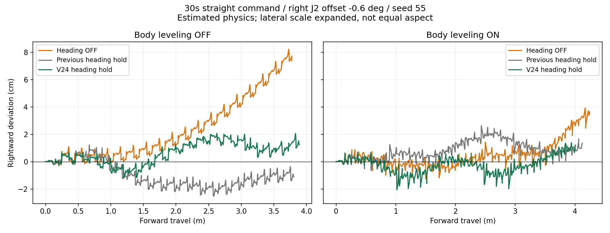

# V24 직진 방향 보정 검증

IMU 보정을 개선했지만 **경로 이탈의 완전 제거에는 도달하지 못했다.** 방향 유지와 위치/경로 유지는 별개이며, 현재 제어 입력에는 외부 위치 관측이 없다. 실제 로봇에서 같은 정밀도를 보장하는 결과도 아니다.

## 최종 변경

- 출발/회전 종료 후 200ms 동안 방향 샘플을 원형 평균하여 기준을 정한다. 359.9°와 0.1°도 올바르게 평균한다.
- 0.3° 미만의 방향 오차를 버리던 데드밴드를 제거한다.
- 저역 필터 계수를 0.2에서 0.1로 변경하고, 적분 이득을 0.006에서 0.04로 올려 지속적인 작은 편향에 대응한다. 비례 이득 0.035는 유지한다.
- 출력 ±0.25, 적분 ±0.15, 초당 출력 변화 0.5, 수동 회전/정지/후진/센서 실패 시 해제 조건은 유지한다.
- STM32와 MuJoCo는 같은 `heading_control.h`를 사용한다. 버전은 `shared-locomotion-v24`, 가상로봇은 `shared-locomotion-v24-sim`이다.

오른쪽 J2 오차 -0.6°를 상쇄하거나 MuJoCo의 실제 위치로 제어하지 않았다. 센서 지연, 노이즈, 기존 yaw 드리프트 0.02°/s도 유지했다. 실제 좌표는 결과 채점에만 사용한다.

## 30초 최대 직진 결과

J2 스포츠, 오른쪽 앞·뒷다리 J2 영점 오차 -0.6°, 회전 명령 0. 단위 cm, 오른쪽이 양수다. 기존 결과는 `diagnostics/right-drift`, V24는 `diagnostics/heading-v24/30s-1000`에 있다.

| 수평 보정 | IMU seed | 기존 직진 보정 최종 이탈 | V24 최종 이탈 | 기존 경로 RMS | V24 경로 RMS |
|---|---:|---:|---:|---:|---:|
| OFF | 55 | -1.09 | +1.24 | 1.30 | 0.95 |
| OFF | 77 | -2.48 | +1.29 | 2.06 | 0.74 |
| ON | 55 | +1.36 | +1.21 | 1.01 | 0.68 |
| ON | 77 | -0.00 | +1.49 | 0.26 | 1.04 |

약 3.85~4.06m 전진했다. 네 조건의 경로 RMS 평균은 약 1.16cm → 0.85cm, 최악 RMS는 2.06cm → 1.04cm로 줄었다. 모든 개별 조건이 개선된 것은 아니다. 특히 수평 ON/seed77은 기존 결과가 더 좋았다. 따라서 어느 한 번의 최종 오차만으로 완전한 직진이라고 판단하지 않는다.

직진·수평 보정을 모두 끈 기준 사례는 약 3.78m 전진 후 오른쪽 7.37cm, 최대 경로 이탈 8.22cm였다. V24의 같은 수평 OFF/seed55 조건은 최종 1.24cm, 최대 2.07cm다.

## 추가 검증과 한계

`validate_heading_precision.py`는 위 4개 조건 외에 대칭 모델과 반대 부호 오차, seed91, 60초 직진, 60% 직진 입력까지 12개 조건을 기록한다. `passed`는 안전 오류/비발 접촉 없이 정지했다는 뜻이며 정밀도 목표 통과가 아니다. 상세 수치는 `diagnostics/heading-v24/validation.json`을 참고한다.

더 강한 비례 보정은 특정 조건에서 최종 오차가 수 mm였지만 반대 오차 조건에서 이탈을 키워 채택하지 않았다. 최종 설정은 여러 조건에서 편향 감소와 안정성을 함께 확인해 선택했다.

IMU의 방향 드리프트와 발의 횡미끄럼은 방향 제어만으로 완전히 구분/관측할 수 없다. 장시간 동일한 직선 경로를 유지하려면 카메라 등 외부 위치 관측과 이를 사용하는 경로 보정이 추가로 필요하다. 현재 코드에는 그 기능이 구현되어 있지 않다.

## 실행

기존 가상로봇을 종료한 후 저장소 루트에서 실행한다.

```sh
PYTHONPATH=tools/servo_tool:simulation/mujoco \
/opt/anaconda3/envs/spot_omg/bin/mjpython \
simulation/mujoco/virtual_robot.py --viewer --profile jointsport \
--parameters simulation/mujoco/scenarios/right_drift.json \
--heading on --balance on
```

앱의 `IMU 직진 방향 유지`와 `BNO055 수평 보정`으로 각각 비교한다. 실제 폰을 사용하며 iOS Simulator는 실행하지 않는다.




## 완료한 검증과 적용 범위

- 관련 Python/C 공통 제어 테스트 64개 통과. 12개 직진 조건과 8개 회전 조건에서 안전 정지 확인.
- 60초/seed91/-0.6° 오차에서는 수평 OFF 약 7.85m 후 오른쪽 8.46cm, 수평 ON 약 8.34m 후 6.01cm가 남았다. 장시간 경로 이탈의 완전 제거 목표는 미달이다.
- 모든 정책의 60초 기준 속도를 다시 측정했다. J2 스포츠는 대칭 모델에서 약 0.139m/s이며 앱 속도 표기에 반영했다.
- 실제 폰 UJIN17에 앱 V0.4.6 (18) 설치 완료. 폰 잠금 상태로 원격 실행은 거절되었으므로 잠금 해제 후 앱을 열어야 한다. 로봇 펌웨어는 코드/빌드만 준비하며 전송하지 않는다.
- 실제 기구 영점 검증과 영구 기록은 [Stand11 검증 절차](STAND11-MECHANICAL-CALIBRATION-2026-09-10.md)를 따른다.
