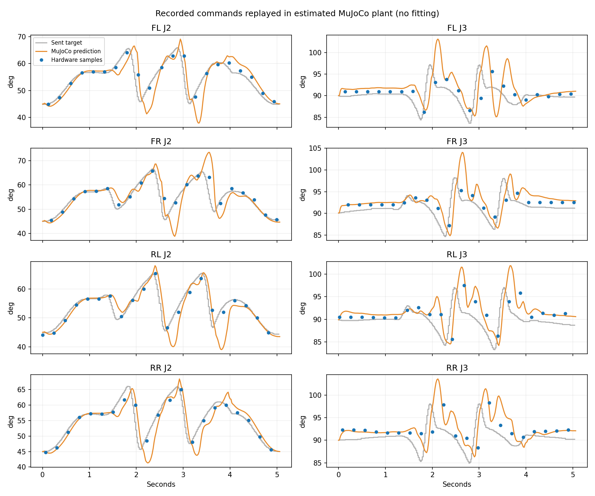

# 실물 관절 응답 1차 검증 — 2026-09-12

## 결론

**실제로 전송한 목표와 실제 서보 응답을 수집하고, 동일한 목표를 MuJoCo에 재생해 비교했다.** 현재 추정 모델은 관측 시점에서 최대 관절별 RMS 예측 오차가 전진4.57°, 좌회전3.18°, 우회전3.05°였다. 허용 오차 기준·장기 반복·다른 하중 조건을 통과한 모델이라고 선언하지 않는다. 이번 데이터에 맞춰 물리 파라미터를 변경하지 않았다.

크루즈 정책은 턴에서 J3 목표 이동 범위 자체가 전진보다 작았다. J1은 턴에서 큰 이동을 요구하며 실제 추종 오차도 커졌다. 관절각 이동 범위만으로 발의 지면 여유나 모터 토크 부족을 확정하지 않는다.

## 준비와 실제 설치

- Mac의 Spot OMG 앱에 BLE 연결 상태가 남아 있었다. 앱에서 해제한 뒤 직접 연결 성공.
- V45 상태: custom, torque off. 서보12개 모두 응답, 전압11.2~11.5V, hw=0.
- V46 설치·readback 성공. 토크OFF를 재확인하고 자세 이동 없이 설치했다.
- Landing → Stand 전환 모두 OK. BNO055 활성 I2C 경로의 calibration은 gyro3/accel3, 저장값 복원 yes였다. `imuprobe`는 사용하지 않는 SPI 센서용 검사였으며 FAIL을 활성 BNO055 고장으로 해석하지 않았다.
- V46 전진은5185ms에 정상 종료. 긴 baldiag/dump 전송에서 누락·타임아웃이 발견되어 해당 원본으로 정밀 분석하지 않았다.
- V47은12개 단위 페이지와 개수 검증을 추가했다. Landing을 완료한 뒤 설치했고 V47·jointtracepage·84MHz를 실기에서 확인했다. 보행 알고리즘·모터 방향·안전 조건은 바꾸지 않았다.
- V47 SHA256: `b5385eac158655da4b04f68c3dd330b46805d0347bf0444aebed08996355b455`.
- 마지막 자세: Landing, torque on, safety ok, fault_code0, error13틱(약1.14°).

## 동일 정책 단기 시험

모두 `cruise`, servo profile3400/254, 전진 또는 턴 입력1000. 방향별 전체 기준을 바꿔 맞추지 않았다. 각 시험은 별도 Stand 준비 후 최대5초 호스트 전송과 sequence Stop으로 종료했다. 캡처에는 시작·정지 전환이 포함된다. 아래 각도 범위는 캡처 전체의 최대−최소이며 순수 스윙 진폭과 동일하지 않다.

| 캡처 | 실기 동작 시간 | 명령/측정 수 | 결과 | 보행 중 최저 전압 |
|---|---:|---:|---|---:|
| forward-02 |5040ms|252/252|정상 Stop, safety ok|10.8V|
| left-02 |4805ms|241/241|정상 Stop, safety ok|11.0V|
| right-01 |4805ms|241/241|정상 Stop, safety ok|10.8V|

left-01은 준비 확인에서 custom으로 보고되어 **모션 없이 거부**됐다. IMU 정지 보정은 순수 Stand 기준과 다른 목표를 만들 수 있다. left-02에서는 Stand 명령 완료를 다시 확인하고 safety/torque 상태를 확인한 뒤 실행했다. 이 기록을 실패한 좌회전으로 세지 않는다.

### J3 이동 범위

표의 범위는 네 다리 중 최소~최대다. 관측 범위는 약240ms마다 읽은 표본의 범위여서 사이에 발생한 최고점을 놓칠 수 있다.

| 동작 | 전송 목표 범위 | 관측된 실제 범위 |
|---|---:|---:|
| 전진 |13.10~13.71°|8.09~11.87°|
| 좌회전 |9.14~9.67°|5.36~7.21°|
| 우회전 |9.14~9.58°|4.83~7.03°|

J2 목표 범위는 전진21.01~21.62°, 좌회전17.67~18.54°, 우회전18.02~18.28°였다. J1 목표 범위는 전진0.79°에 비해 양쪽 턴20.13°였다. 턴의 J1 관측 범위는 좌14.77~17.05°, 우12.66~15.21°이며 RMS 추종 오차는 약2.47~3.90°였다.

## 실제 시간 측정

- 정상 명령 간격:20~21ms.
- 정상 서보 조회 요청~응답 완료:최대2ms(좌/우 캡처).
- 전진에서는 조회1회가31ms 걸렸고 명령 간격이34ms로 늘었다. 그 프레임의 I/O 최대34ms, late_frames1. 나머지 두 턴의 late_frames0.
- 읽기 재시도 누적 카운터도 증가했다. 이 카운터는 정지·다운로드 사이의 안전 조회까지 누적되므로 그 차이를 그대로 보행 중 재시도 횟수라고 하지 않는다.
- 위2ms/31ms는 **통신 조회에 걸린 시간**이며 모터의 움직임 시작 지연이 아니다.
- 약240ms/축 조회에서 계산한 지연 후보는 확정값으로 채택하지 않았다. `delay_estimate_ms`는 null이다. 정밀 지연 측정과 반복 식별은 남아 있다.

## 실제 명령의 MuJoCo 재생

원본의12축 전송 목표를 signed 누적 틱 → 관절각으로 복원했다. 위치 피드백은 명령의 검증된 회전 기준 가까이 연결하며, 음수 목표를 단순 modulo하여 전송하는 코드는 추가하지 않았다.

모델 질량4.418kg, 기존 추정 모터/쿠션/마찰, 명령 지연20ms 설정을 유지했다. 이미 서보로 인코딩된 명령이므로 재생 시 재양자화는 하지 않았다. 초기 자세를 첫 전송 목표에 맞춰 지면에 배치하고, 몸체/접촉은 물리 계산으로 움직였다. 실제 시작 몸체 위치·접촉력·하중은 측정하지 않았으므로 이를 정확한 초기 상태라고 하지 않는다.

재생은20ms 간격의 직전 명령 유지 방식이다. 실기 전송 시각의 작은 흔들림은20ms 해상도로 반영되므로 서브프레임 정밀 일치 시험이 아니다. 각 실제 조회 시각에 예측 관절각을 보간해 비교했으며 첫1초는 RMS 집계에서 제외했다. 정지 구간까지 포함한 단기 캡처 비교다.

| 동작 | 관절별 실물 대비 예측 RMS 오차 범위 |
|---|---:|
| 전진 |0.44~4.57°|
| 좌회전 |0.68~3.18°|
| 우회전 |0.35~3.05°|

주황색: MuJoCo 예측, 파란 점: 실제 조회, 회색: 전송 목표. 파란 점 사이의 실제 움직임은 측정하지 않았다.



## 검증 수준과 다음 단계

1. 빌드·호스트:40개 검사 통과. 페이지 누락 검출과 오프라인 분석을 포함한다.
2. 설정 readback:V47,84MHz,속도3400/가속도254 확인.
3. 실제 자세:Landing/Stand 완료와 이후 상태 확인. 장시간 위치 유지 전용 시험은 아니다.
4. 전체 동작:전진/좌/우 각1회 짧은 실행·Stop 및 원본 수신 완료. 보행 안정성·내구성 인증은 아니다.
5. 모델 대조:실제 전송 명령을 사용한 기존 모델 예측 오차 확인. 물리 파라미터 식별 완료가 아니다.

다음은 턴에서 요청되는 CAD 발끝 높이/이륙 시점과 J1 이동을 같은 시간 기준으로 확인하고, 문제 축에 대해 더 높은 시간 해상도의 측정을 구성하는 것이다. 반복 캡처와 분리된 검증 데이터를 확보하기 전에는 추정 지연을 시뮬레이터 정답으로 넣지 않는다. J3 교체 필요성도 이번 자료만으로 결론 내리지 않는다.

## 84MHz 선택의 근거

84MHz는 여러 클럭을 비교해 최적화한 결과가 아니다. 이전16MHz에서 원호 계산 최대44ms가20ms 주기를 넘었고, PLL `16/16*336/4=84MHz`로 바꾼 후 최대9ms를 실기에서 확인했다. 최대클럭180MHz는 [ST 공식 F446RE 사양](https://www.st.com/en/microcontrollers-microprocessors/stm32f446re.html)이다. 180MHz 적용의 전압 스케일·Flash·주변장치 타이밍 검증은 별도로 필요하다. 이번 검증에서는 주파수를 바꾸지 않았다.

## 재현 및 원본

- `artifacts/audits/joint-capability-2026-09-12/hardware-comparison.json`
- `hardware/{forward-02,left-02,right-01}/trace.log`: 전체 원본
- 같은 폴더 `analysis/`: 관절별 보고서/CSV/JSON
- 같은 폴더 `replay/`: 재생 비교 그림/CSV/JSON

```sh
python tools/download_joint_trace.py --output 새기록.log
spotctl analyze-joints 새기록.log --output 결과폴더
python simulation/mujoco/replay_joint_trace.py 새기록.log --output 재생결과폴더
```

실물 실행 도구 `tools/capture_joint_response.py`는 `--execute` 없이는 모션을 시작하지 않는다. `--prepare-stand`는 실제 Stand 전환을 수행한다. 원본 폴더가 이미 있으면 덮어쓰지 않는다.
