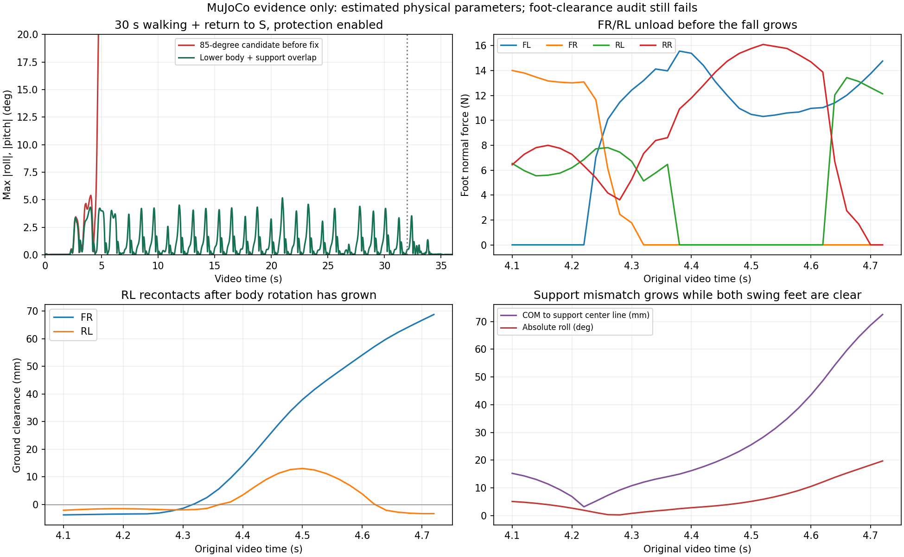

# 큰 J2 회수 동작의 전도 분석과 수정 후보

> 후속 사용자 조건: 몸체를 낮추는 방법은 채택하지 않는다. 아래 45mm 낮춤
> 결과는 과거 비교 실험으로 보존하며, 현재 해결안이 아니다.
> [기본 높이·J1 유지 조건의 후속 분석](STANDARD-HEIGHT-BALANCE-2026-09-17.md)을 참고한다.

2026-09-17, MuJoCo 전용 실험. 원래 V6.2.7 및 실기 V77은 보존했다.
**수정 후보는 30초 보행과 S 복귀를 기울기 보호 없이 완료했다.
발 여유/스윙 중 접촉 기준은 아직 미달이며 실기 검증 완료가 아니다.**

## 직접 관측한 전도 순서

기준은 첫 두 진입 걸음 이후 J2=85°, J3=104° 회수를 시작했던 후보다.
입력 344, 시작 전 2초 대기, 동일한 바닥/서보/배터리 모델을 사용했다.

| 영상 시각 | 몸체 roll | FR/RL 접지 하중 | COM–FL/RR 지지선 거리 |
|---|---:|---|---:|
| 4.40 s | −2.87° | 둘 다 0 N | 16.23 mm |
| 4.50 s | −5.14° | 둘 다 0 N | 25.56 mm |
| 4.60 s | −10.54° | 둘 다 0 N | 43.51 mm |
| 4.68 s | −16.81° | RL 재접촉 13.12 N | 보호 정지 발생 |

이 기록에서는 **발이 걸린 뒤 넘어지기 시작한 순서가 아니다.** 두 스윙 발이
떠 있는 동안 지지 대각선 주위로 몸체가 기울어지고, 이후 RL이 다시 닿는다.
지지선 거리는 쿠션 중심을 사용한 대용 지표다. 실제 접촉면/COP·각운동량까지
포함한 동역학 판정을 이 거리 하나로 대체하지 않는다.

## 원인 분리

- J2만 크게 올려도 4.70초에 보호가 발생했다. J3 접힘량만 104°로 늘리면
  8초 동안 보호는 없었지만 중간 스윙 접촉이 남았다.
- 앞뒤 이동을 기존 궤적으로 유지하고 높이만 40mm 추가한 시험도 4.72초에
  보호가 발생했다. 따라서 뒤로 휘두르는 X 궤적만 고치면 해결된다는 가설은
  이 시험에서 성립하지 않았다.
- 큰 동작을 4걸음/6걸음 뒤로 미룬 경우도 각각 6.82/8.92초에 실패했다.
  단순히 준비 걸음을 늘리는 수정은 채택하지 않았다.
- 기존 보행은 뒷발이 계획상 스윙 중에도 바닥을 지지한다. 큰 회수로 그 접촉을
  제거하면 대각선 두 발로 지지해야 하는 문제가 드러난다. 소프트웨어의 지지
  전환 설계가 이번 전도 개선 대상이다. 실제 H/W 한계를 확정한 결과가 아니다.

## 확인된 코드/기하 문제

1. `fr_entry_targets()`는 좌우 지지 이동을 계산하지만 `steady_j1_hold`에서
   J1을 고정한 뒤 X/Z만 다시 푼다. 지지 Y 목표를 0→10mm 바꾼 독립 검사에서
   최종 관절 명령 차이는 정확히 0°였다. 해당 모드에 능동 좌우 체중 이동이
   적용된다고 해석하면 안 된다. 그 경로를 연결한 비교도 실패했으므로, 기존
   V6.2.7 동작을 무조건 바꾸지는 않았다.
2. 기존 몸체 높이에서 J2=85°와 16mm 발 여유를 동시에 요구할 수 없다.
   RL의 J1=−9°, J3 명령 0..130° 전체 CAD 검사에서 최소 높이는 S보다
   약 **37.8mm 위**였다. 이전 일부 설명의 “40mm 초과”는 J1/검색 범위를
   명시하지 않은 수치였으며 이 결과로 정정한다. 사진 투영각·제어각·링크
   내각은 동일하지 않다.
3. 추가했던 J2/J3 명령은 공중 회수 동작이었다. 이 실험 자체가 지면 추진력을
   늘렸다는 뜻은 아니다. 선택한 수정 후보도 기존 지지 구간 X 경로를 유지한다.

## 선택한 수정 후보

설정: `config/large_recovery_balanced_candidate.json`의 `height45-duty70`.
공식 프로필 등록이나 앱/실기 배포를 하지 않은 검토용 후보다.

- 첫 두 진입 걸음 동안 몸체를 45mm 낮춰 큰 J2 각도와 발 여유를 함께 만든다.
  FR의 첫 J1 두 배 오므림, 이후 네 다리 정상 오므림 각도는 유지한다.
- 진입 종료 후 **각 다리가 착지할 때** 지지 비율을 50→70%로 전환한다.
  스윙 도중 위상을 되돌리지 않는다. 다음 대각선이 먼저 착지할 지지 중첩을
  만들며, 별도의 제자리 대기 구간은 없다.
- 새 지지 구간을 거친 발부터 J2 큰 회수를 적용한다. J2=85°는 CAD 상
  윗링크가 수평에서 약 9.45° 아래인 제어 목표다.
- 정지 시 낮은 몸체 높이에서 두 쌍을 각각 한 번씩 S의 X/J1에 맞춘다.
  이후 네 발로 지지하며 몸체 높이를 복원한다. J1을 정지 후 천천히 벌리는
  동작은 없다. 이전에는 한 쌍씩 몸체 높이까지 복원해 정지 중 기울었다.

## 검증 결과와 한계

| 항목 | 8초 보행 | 30초 보행 |
|---|---:|---:|
| 기울기/추적 보호 | 없음 | 없음 |
| 최대 roll/pitch 절댓값 | 4.33° | 5.17° |
| Stop 후 S 실제 최대 관절 오차 | 0.99° | 0.99° |
| 전진 변위 | 0.281 m | 1.043 m |

8초 기록의 정상 구간에서 네 J2 실제 최대는 약 84.6°이며 J3 목표 최대는
125.34°, 실제 최대는 125.28°다. 정상 구간 평균 위상 속도 계수는 약 0.94다.
입력 344와 명목 주기 1.8초는 유지했으나, 서보 추적 감속으로 실제 위상 속도는
변한다. 실제 동작 속도가 완전히 같다는 검증은 아니다. 충돌·기울기 보호·기존
서보 제한을 끄지 않았다. 물리 모델의 미실측 특성도 이번에 임의로 바꾸지 않았다.

**발 여유 검사는 실패한다.** 30초 기록의 마지막 20초에서 FR은 중간 스윙
표본의 10.38%에 0.5N 초과 접촉이 있었다. 예: 14.14~14.16초, 16.42~16.44초,
18.70~18.72초, 20.92~21.00초. 대부분 스윙 후반 조기 접촉이다. 다른 세 발은
이 구간의 중간 스윙 하중이 없었지만 최소 여유가 2mm 기준보다 작았다.
첫 진입/전환 구간의 뒷발 접촉도 남는다. 접촉력만으로 실제 미끄럼/발끌림을
동일시하지 않으며, 이 기준 미달을 “깨끗한 보행 성공”으로 바꾸지 않는다.

몸체 높이 변경 없이 지지 이동/자세 피드백을 추가한 후보, 강한 J3 접힘,
스윙 후반 추가 들림은 개선되지 않거나 다른 구간을 악화했다. 실패 자료도
아래 폴더에 남겼다. 그중 `late12`는 J3가 130° 기준도 넘어 채택하지 않았다.

호스트 검사 9개 통과: 착지 경계에서만 지지 비율 전환, 경계 궤적 연속성,
낮은 자세에서 두 번의 S 배치, 기존 고정 J1 경로의 지지 Y 미반영 확인,
J2=85° 기하 제약, 위상별 접촉 평가 등을 검사했다.

## 재현과 자료

```powershell
$env:PYTHONPATH='.;tools/servo_tool'
python simulation/mujoco/scripts/analysis/analyze_large_recovery_balance.py --configs config/large_recovery_balanced_candidate.json --output artifacts/imu-trace-v77/j2-horizontal/verification-new --seconds 30
python simulation/mujoco/scripts/analysis/capture_large_recovery_candidate.py --config config/large_recovery_balanced_candidate.json --output artifacts/imu-trace-v77/j2-horizontal/video-new
pytest simulation/mujoco/tests/test_large_recovery_balance.py simulation/mujoco/tests/test_j2_after_push.py simulation/mujoco/tests/test_hardware_gait_evidence.py -q
```

자료 루트: `artifacts/imu-trace-v77/j2-horizontal/`.
선택 후보 원본은 `support-overlap-screen/height45-duty70.json`,
30초 검증은 `long-validation/height45-duty70.json`, 영상은
`balanced-candidate-video/four-views.mp4`.
`causal-ablation/`, `support-screen/`, `timing-screen/`, `predictive-screen/`,
`height-screen/`, `clearance-screen/`, `capture-screen/`, `orientation-screen/`,
`ground-frame-screen/`, `activation-screen/`, `fold-support-screen/`,
`touchdown-screen/`에는 나머지 비교 결과가 있다.

일부 초기 실패 실험의 접촉 요약은 보호 후 고정된 위상 구간도 포함했다.
그 요약 비율끼리는 비교하지 말고 원본에서 최초 보호 전 표본만 사용한다.
현재 평가기는 실제 보행 중이고 보호가 없는 표본만 접촉 검사에 사용한다.
8/30초 선택 후보는 전체 구간에 보호가 없으므로 해당 수정으로 결과가 바뀌지 않는다.


