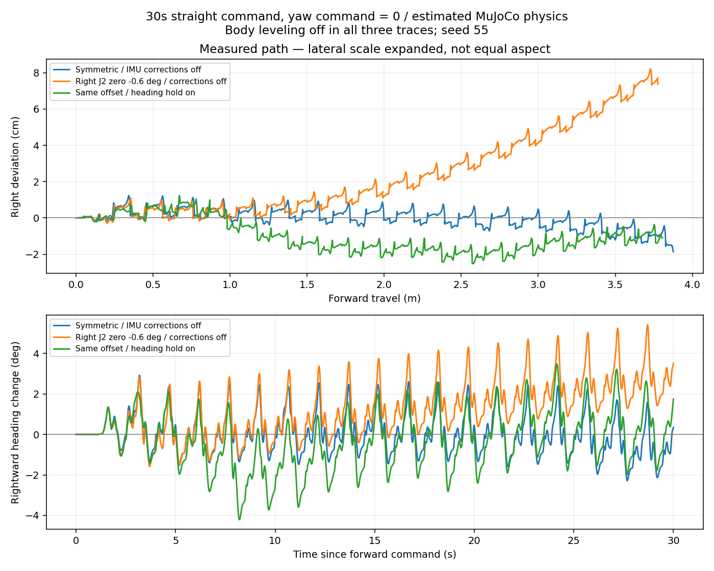

# 직진 중 우측 편향 재현

이 문서는 V23 기준 재현 결과다. 이후 제어 변경과 잔여 오차는 [V24 검증](HEADING-PRECISION-V24-2026-09-10.md)을 참고한다.

오른쪽 앞·뒷다리 J2에 -0.6° 기계적 영점 오차를 가정한 MuJoCo 시나리오다. 실제 로봇에서 측정한 오차 또는 원인 진단이 아니다. 회전 명령은 0이며, 오차는 서보 명령 변환 후 실제 관절 구동에 적용한다. 기본 물리 파라미터와 보행정책은 변경하지 않았다.

## 실행

저장소 루트에서 기존 가상로봇을 종료한 뒤 실행한다.

```sh
PYTHONPATH=tools/servo_tool:simulation/mujoco \
/opt/anaconda3/envs/spot_omg/bin/mjpython \
simulation/mujoco/virtual_robot.py --viewer --profile jointsport \
--parameters simulation/mujoco/scenarios/right_drift.json \
--heading off --balance off
```

실제 폰 앱에서 가상로봇에 연결하고 최대 직진을 입력한다. 화면에 `right-drift-j2-zero`, `balance OFF`, `heading OFF`가 표시된다. 앱의 `IMU 직진 방향 유지`를 켜면 동일한 기계 오차에서 방향 보정을 비교할 수 있다. `BNO055 수평 보정`은 별도 기능이다. IMU 기울기 안전 정지는 유지된다.

기본 대칭 모델로 복귀하려면 `--parameters`, `--heading`, `--balance`를 생략하여 다시 실행한다. 기본값은 두 보정 모두 on이다.

## 측정

J2 스포츠 정책, 30초 최대 직진, 회전 입력 0, 수평 보정 off. 초기 방향 기준 오른쪽을 양수로 측정했다.

| 조건 | 전진 거리 | 최종 좌우 이탈 | 최종 우측 방향 변화 |
|---|---:|---:|---:|
| 대칭 모델, 직진 보정 off, seed 55 | 3.877m | 왼쪽 1.86cm | 0.34° |
| J2 오차, 직진 보정 off, seed 55/77 | 3.777m | 오른쪽 7.37cm | 3.52° |
| J2 오차, 직진 보정 on, seed 55 | — | 왼쪽 약 1.1cm | 1.75° |
| J2 오차, 직진 보정 on, seed 77 | — | 왼쪽 약 2.5cm | 1.62° |

수평 보정 on/off × 직진 보정 on/off × IMU seed 55/77의 8개 조건 모두 안전 오류·발 이외 접촉 없이 정지했다. 이 통과 기준은 완벽한 직진을 뜻하지 않는다. 수평 보정 on / 직진 보정 off에서는 오른쪽 이탈이 약 3.6~24.7cm로 달라졌다.

기존 물리·가상로봇 테스트 34개 통과. 재현 스크립트는 `diagnose_right_drift.py`, 비교 검증은 `validate_right_drift.py`, 결과는 `simulation/mujoco/diagnostics/right-drift/`에 있다.



그래프의 횡방향 단위는 cm이며 차이를 보기 위해 확대했다. 경로 그림은 가로·세로 동일 축척이 아니다.
