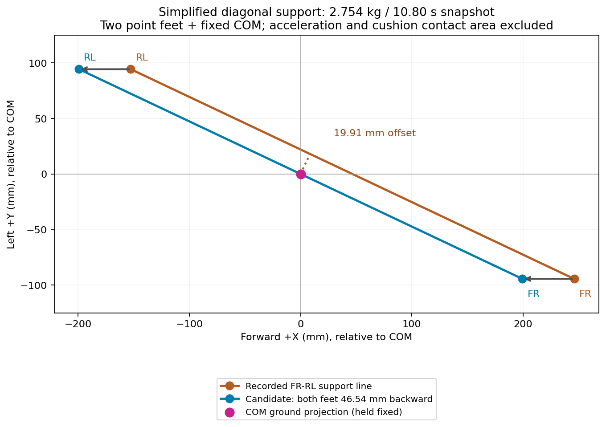

# 대각선 지지 위치의 단순 계산

몸체 위치를 고정하고 두 발의 수직 반력만 고려하면, 원본 기록 10.80초의 **FR/RL 착지점을 모두 뒤로 46.54mm** 옮긴 배치에서 정적 평형이 성립한다. 이 결과는 그 한 장면의 기하 계산이며, 현재 후보의 최적 보정량이나 검증된 보행 목표는 아니다.

## 단순화와 입력

- 몸체 전체를 질량 2.754kg의 점 하나로 취급한다. 무게는 `2.754 × 9.81 = 27.01674N`이다. 총질량은 실측이고, COM 위치는 추정 질량분포를 사용한 CAD 계산이다.
- 발 중심 두 개 FR/RL만 수직 힘을 낸다고 가정한다. 몸체 가속도, 각운동량 변화, 유한한 쿠션 접촉면·압력 중심·마찰을 제외한다.
- 실제 10.80초에는 FL/RR에도 약 1.9/1.7N의 접촉력이 남아 있다. 아래 계산은 그 두 발을 완전히 뗀다고 가정한 비교이며, 실제 네 발 접촉 상태의 전체 힘을 푼 것이 아니다.
- yaw를 제거하고 지면에 투영한 좌표이며, +X는 전방, +Y는 좌측이다. 단위 mm.

| 점 | X | Y |
|---|---:|---:|
| 무게중심 C | −4.245 | +0.965 |
| FR, A | +241.746 | −93.408 |
| RL, B | −156.922 | +95.231 |

원본 자료: `artifacts/audits/sway-2026-09-14/contact-geometry-decomposition.json`, `causal-nocorrection.json`의 10.80초 상태.

## 계산

두 발 수직 반력 합은 무게와 같아야 하고, 힘으로 가중한 지지점 위치는 COM 투영과 같아야 한다.

```
F_FR + F_RL = mg
F_FR × (A + Δ) + F_RL × (B + Δ) = mg × C
```

`λ = F_RL / mg`로 놓으면 `A + Δ + λ(B−A) = C`이다. 정적 평형에서는 COM 투영이 두 지지점을 이은 선분에 놓여야 한다. 이는 [MIT Underactuated Robotics의 CoP·모멘트 평형식](https://underactuated.csail.mit.edu/humanoids.html)의 가속도·각운동량 변화가 0인 특수 경우다. 두 점만으로는 횡방향 여유가 없는 이상화된 평형이며, 교란에도 안정적이라는 뜻은 아니다.

앞뒤로만 옮기면 `Δy=0`이므로 다음과 같다.

```
λ = (Cy−Ay)/(By−Ay) = 0.500285
Δx = Cx−Ax−λ(Bx−Ax) = −46.54275mm
F_FR = (1−λ)mg = 13.50066N
F_RL = λmg     = 13.51608N
```

현재 지지선에서 COM까지의 최단 거리는 19.90674mm이다. 무게와 이 거리를 곱한 모멘트 대용값은 `27.01674 × 0.01990674 = 0.53782Nm`이다. 이는 단일 J1/J2/J3 모터 요구 토크가 아니다.

| 두 발을 같은 방향으로 옮기는 조건 | 각각의 이동량 | FR 반력 | RL 반력 |
|---|---|---:|---:|
| 앞뒤만 | 뒤로 46.54mm | 13.501N | 13.516N |
| 좌우만 | 오른쪽 22.02mm | 10.347N | 16.670N |
| XY 최소 거리 | 뒤로 8.51mm + 오른쪽 17.99mm | 10.924N | 16.093N |



## 지금까지 실제 후보에 넣었던 양

별도의 착지점 이동 보정인 `FootholdTransfer`는 **X/Z를 유지하고 Y만 최대 ±10mm** 바꿨다. 최종 60초 후보 기록의 보정량은 다음과 같다.

- FL/RR: 두 발 각각 좌측 +10mm.
- FR/RL: 두 발 각각 우측 −10mm.
- 앞뒤로 착지점을 뒤로 옮기는 별도 보정: 0mm.

기본 궤적 자체의 앞뒤 이동 파라미터는 96mm, 즉 명목 ±48mm이다. 설정의 `touchdown_x_offset_m=0.02`는 Y 보정 계산에서 사용하는 **앞쪽 20mm의 착지 예측값**이며, X를 실제로 20mm 이동시키는 명령이 아니다. 이는 최종 roll/pitch 보정 전의 계획값이고, 실측 접촉 위치와는 구분한다.

이번 46.54mm 계산은 원본 1.35초 주기의 한 시점을 사용했고, 위 ±10mm 설정은 3.2초 주기 FF 후보다. **조건과 이동축이 달라 단순히 10→46.5mm로 설정을 교체하면 안 된다.** 이 단순 계산 단계에서는 새 착지점을 적용하지 않았다. 이후 별도의 정적·가속도 반영 실험에 적용해 녹화했으며, [후속 물리 시뮬레이션 결과](CALCULATED-PLACEMENT-SIMULATION-2026-09-14.md)는 모두 안전 정지로 실패했다.

## 검증 범위

계산 스크립트에서 세 해 모두 양의 반력, 반력 합 `mg`, 모멘트 잔여 `1e−10Nm` 미만을 검사했고 독립 계산으로 대조했다. 관절 도달성·속도·모터 토크·보행 동역학은 이 계산에서 검증하지 않았다. 제시한 위치는 다음 착지점을 검토하기 위한 값이며, 하중을 받은 현재 발을 바닥에서 이동시키는 명령이 아니다.

재현: `artifacts/audits/sway-2026-09-14/simplified_support_calculation.py`; 수치: `simplified-support-calculation.json`.
