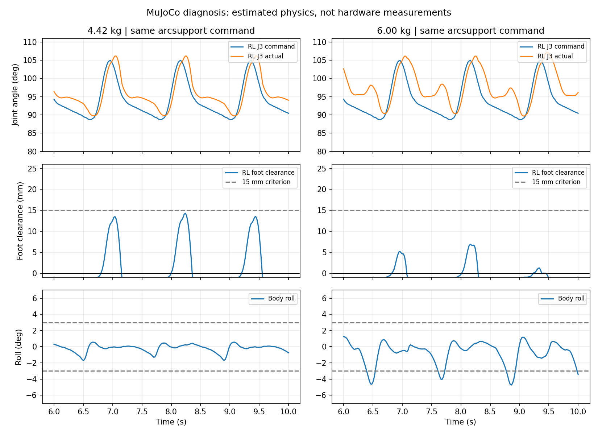

# 좌우 턴 발 들림 부족: 코드와 질량 비교 분석

## 결론과 검증 범위

실물 전도 원인은 아직 확정되지 않았다. 2026-09-12 재조회에서도 BLE 기체가 검색되지 않아 전도 시점의 위치·전류·IMU 기록은 확보하지 못했다. 다만 현재 정책은 6kg 질량 조건에서 발 들림을 유지하지 못하며, 특히 J3 토크 한계와 추종 오차 증가가 실제 MuJoCo 계산으로 재현된다. 이것은 실물 모터 고장이나 실제 질량6kg을 뜻하지 않는다.

이전 답변의 임의 지렛팔10cm × 하중41N =4.1Nm은 현재 관절 자세에서 계산한 값이 아니었다. 이 값을 근거로 J2/J3 용량 부족을 확정해서는 안 된다.

## 재현 조건

`arcsupport` 공유 C 정책, 좌/우 최대 회전 각20초, 평가5~19.5초. 관절·쿠션 형상·명령·모터 모델·배터리 설정·안전 기준은 동일하게 유지했다. 기본 질량4.418kg과 보수적6kg을 비교했다. 원래 모델은4.418kg이며, 대화에서 제안한6kg이 기본 모델에 이미 들어 있던 것은 아니다.

6kg 모델은 중앙 몸체2.6kg+배터리0.6kg, 다리 그룹2.78kg+쿠션0.02kg이다. 질량이 증가하면 같은 형상의 관성도 증가한다. 기존 CAD feedforward의 추정 질량은 그대로 유지하므로, 이 시험은 현재 제어기의 질량 불일치에 대한 민감도 시험이다. 배터리 개방전압11.1V·배선저항0.06Ω 모델은 동일하며, 하중 증가에 따른 전압강하도 계산된다. 마찰, 강성, 모터 곡선 등은 추정값이다.

시험은 초기 Stand 계열 자세에서 시작한다. 사용자 실물의 Landing→Stand 전환 또는 실제 전도를 재현한 시험은 아니다. 모터를 움직이는 실기 시험은 수행하지 않았다.

## 결과

| 지표 (좌우 중 최악) | 4.418kg | 6kg |
|---|---:|---:|
| 최대 roll |1.70°|5.71°|
| 최대 pitch |0.79°|2.25°|
| J3 관절별 최대 추종 RMS |3.11°|5.04°|
| J3 토크 한계 도달 표본 비율 최대 |0%|36.0%|
| J2 토크 한계 도달 표본 비율 |0%|0%|
| 스텝별 최대 발 들림의 최솟값 (목표 위상 기준) |12.16mm|약0mm|
| 스윙 중간 접촉 비율 최대 (목표 위상 기준) |16.7%|50.7%|
| 부하 전압 최솟값 (시뮬레이션) |10.46V|10.10V|

토크 한계 비율은20ms마다 마지막 물리 substep의 토크가 해당 순간 한계의99.5% 이상인 표본 비율이다. 전체 substep 시간 비율 또는 실물 전류 측정값이 아니다.6kg의 J3 최대 토크는 약2.57Nm, J2 최대 약2.05Nm였다. J2가 스톨 한계에 닿지 않았다는 것은 정격 토크·발열까지 여유 있다는 뜻이 아니다.

왼쪽 회전의 RL에서 발이 떨어지는 시점의 중앙값은 예정 스윙 시작 후171ms→211ms로 늦어졌다. 이 시간은 모터 통신 지연 자체가 아니라 궤적·하중·몸체 자세·지면 접촉을 모두 포함한 이륙 시점이다. 한 번에 일정 시간만 더 기다리면 해결된다는 증거로 해석하면 안 된다.

## 코드에서 확인한 사항

1. `robot.c` 초기화의 `tracking_enabled=false`. `robot_shared_drive`는 꺼져 있으면`phase_rate=1`로 진행한다. 관절 피드백은 안전 감시/기록에 쓰지만 현재 기본 경로에서 매 스윙의 이륙 확인 조건은 아니다.
2. `gait_tracking.h`는 켜더라도 전체 관절 오차와 데이터 나이로 위상 속도를 조절하는 실험 기능이다. 실제 지면 접촉 감지나 발 높이 도달 판정은 아니다. 정상20ms마다 한 축을 읽어12축 한 순회가240ms이며, 오래된12축 값을 동시 자세로 계산하면 안 된다.
3. J2/J3의 현재 요구 최대 각속도는 각각 약75/97°/초. 무부하 사양451/270°/초를 넘는 궤적은 아니다. 그러나 하중 조건의 토크·가속도 충족 여부는 별개다.
4. 실기 시작 경로는 `robot_stand`→중립 자세 전환→주기 보행이다. `pose_control.h`에는 사용자 요청으로 유지한 Landing→Stand 빠른 경로(`duration=0`)가 있다. Stand 도중 전도와 주기 보행의 발 끌림을 같은 원인으로 단정하면 안 된다.
5. simulator의 모터 강성35Nm/rad, 감쇠0.8,20ms 명령 지연,25rad/s² 목표 가속도는 실측 식별값이 아니다. 따라서 simulator 명령 일치가 실제 모터 응답 일치를 보장하지 않는다.

## 다음 실기 검증

전도 시점 저장 로그를 확보하고, Stand 단독과 보행 진입을 구분한다. J2/J3 목표·실측·시각·전압·전류/부하를 비교해 모델과 차이가 나는 지점을 확인한다. 스톨 보호 기준을 높이거나 임의로 토크를 올려 우회하지 않는다. 실물 질량과 센서 응답이 확인되기 전에는 모델6kg 결과를 실기 원인으로 확정하지 않는다.

재현 스크립트와 원본: `artifacts/audits/turn-cause-2026-09-12/reproduce.py`, 같은 디렉터리의 summary JSON·프레임 JSON·발별CSV·접촉평가JSON. 저장소 루트에서 환경Python으로 실행한다.

