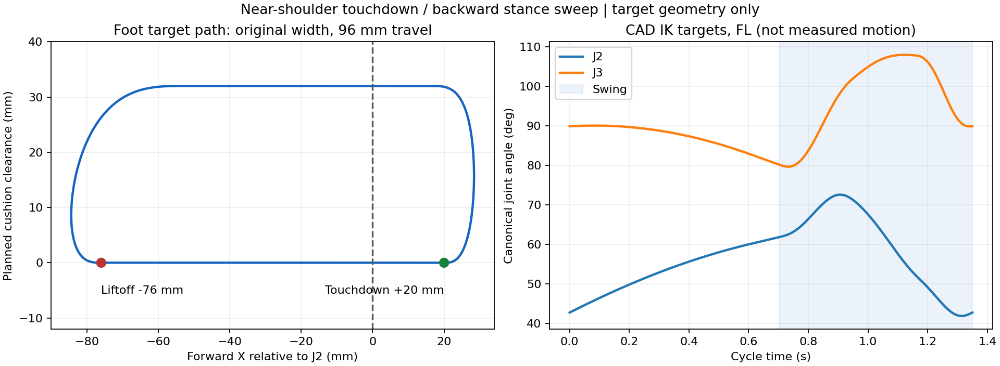

# 어깨 근처 착지·뒤쪽 이륙 궤적 — 첫 비교

사용자 사진의 관찰을 참고해 앞쪽으로 과도하게 내딛지 않고, J2 근처에 착지한 뒤 몸체 기준 뒤쪽으로 발이 이동하는 궤적을 구현했다. **다리 모으기는 후순위로 보류했으며 이 후보에는 적용하지 않았다.**

목표 궤적의 CAD 계산은 통과했지만 실제 MuJoCo 시험은 영상 **11.34초(전진 시작 1.34초 후)에 tilt 안전 정지**가 발생했다. 보행 안정성을 해결한 정책이 아니다.

## 궤적 정의

| 항목 | 값 |
|---|---:|
| 착지 목표 X, 각 다리의 기본 J2 기준 | +20mm |
| 이륙 목표 X | −76mm |
| 접지 목표의 앞뒤 이동폭 | 96mm |
| 공중 구간 포함 X 극값 | −84.38 ~ +28.38mm |
| 목표 발 들림 | 32mm |
| 주기 / duty | 1.35초 / 0.52 |
| 정상 주기 접지 시간 / 스윙 시간 | 0.702초 / 0.648초 |
| 정상 접지 구간 몸체 기준 발 속도 | −0.13675m/s |
| 기본 발 좌우 간격 | 기존 186.12mm 유지 |

접지 구간은 `x = touchdown − (touchdown−liftoff) × phase/duty`의 직선이다. 스윙은 quintic 보간을 사용하되 양 끝의 속도를 접지 구간의 뒤쪽 속도와 연결한다. 위치·속도·가속도가 접지 경계에서 연속이다. 이 때문에 스윙 극값은 접촉 목표 두 점을 조금 넘어간다. 최대 전방 도달이 20mm라고 표현하면 틀리다.

스윙 Z는 기존의 부드러운 상승·높이 유지·하강 궤적을 유지했다. 대각선 FL/RR, FR/RL의 목표 위상은 동일하게 적용한다. 몸체 기준 발을 뒤로 이동시키는 목표가 실제 지면에서 발을 고정한다는 보장은 없으며, 실제 몸체 속도와 접촉 상태를 별도로 검증해야 한다.

**이 비교에서 정상 주기의 X 곡선은 기존 ±48mm 궤적을 뒤로 28mm 이동한 것과 수학적으로 같다.** 착지·이륙 입력을 명시하고 경계 미분을 검사한 것이며, 이 변경만으로 새로운 전신 제어나 접촉 제어를 구현했다고 주장하지 않는다. 과거의 뒤로 46.54mm 보정과도 값·전환 적용 방식이 다르다.

10초 정지 후 기존 1초 진폭 램프로 보행을 시작한다. 첫 램프 중의 목표는 정상 주기의 위 수치보다 작다. 정지 자세 자체는 J2 아래에 발이 정렬된 기존 자세다. J1을 안쪽으로 모으는 오프셋은 0이며, CAD IK 과정에서 발생하는 작은 J1 변화는 남는다.

## CAD 각도 계산

무하중 목표 기하를 한 주기 501표본으로 계산한 값이다. 실제 모터 각도 측정값이 아니다.

- J2 목표 범위: **41.81~72.52°**.
- J3 목표 범위: **79.61~107.94°**.
- J1 목표 범위: **−0.032~+0.243°**. 발 폭을 좁히는 변경은 없다.
- 최대 CAD IK 잔여: **0.0515mm**.



## 물리 시험

2.754kg 총질량, 기존 쿠션, 중력·접촉·서보 속도/토크 제한을 유지했다. 총질량은 실측이며 질량분포·관성·쿠션 물성·모터 모델에는 추정값이 남는다. 비교를 위해 기존 heading/balance 보정은 OFF로 두었다. 새로운 가속도 착지 보정도 적용하지 않았다.

10초 정지와 20초 전진 요청으로 총 30초를 기록했다. tilt 이후에는 전진 명령을 재발행하지 않고 기존 Stop 처리와 그 이후 물리 움직임까지 기록했다.

전진 시작부터 tilt까지의 결과:

| 항목 | 결과 |
|---|---:|
| 영상상의 안전 정지 시점 | 11.34초 |
| 최대 roll / pitch | 13.30° / 5.45° |
| roll / pitch RMS | 4.45° / 2.01° |
| COM 높이 최대−최소 | 15.35mm |
| 최대 관절 추종 오차 | 14.97° |
| 전진 변위 | 0.144m |

중간 스윙에서 실제 발 하중이 1N을 넘은 비율은 FL/FR/RL/RR 순서로 **0 / 59.1 / 54.5 / 0%**다. 목표상 발을 들도록 했어도 FR/RL의 실제 접지가 상당 부분 남았다. 이 짧은 시험으로 모든 원인을 한 가지로 단정할 수 없지만, 궤적의 최종점과 각도가 계산됐다는 것만으로 실제 보행이 성립하지 않음을 보여준다.

## 파일과 검증 범위

- [실제 MuJoCo 상태 녹화](../artifacts/gait-videos/2026-09-14/underbody-sweep-four-views-30s.mp4): 측면·윗면·뒷면·쿼터뷰. 10초부터 전진, 실패 시각 표시.
- [물리 상태·요약](../artifacts/audits/sway-2026-09-14/calculated-underbody.json).
- [목표 각도·궤적 계산](../artifacts/audits/sway-2026-09-14/underbody-kinematics.json).
- `support_sweep.py`: 접지·스윙 X 위치와 시간 미분.
- `ground_frame_nominal.py`: 명시적인 착지/이륙 끝점 선택 및 CAD IK 연결.
- 궤적 경계·미분·입력 검증과 기존 배치/Stop 회귀 **27개 통과**.
- 실물 설정 readback, 위치 유지, 전체 동작 시험은 수행하지 않았다. 앱·실물 펌웨어에 반영한 정책이 아니다.

```sh
/opt/anaconda3/envs/spot_omg/bin/python simulation/mujoco/run_calculated_placement.py underbody
/opt/anaconda3/envs/spot_omg/bin/mjpython simulation/mujoco/render_calculated_placement.py artifacts/audits/sway-2026-09-14/calculated-underbody.json artifacts/gait-videos/2026-09-14/underbody-sweep-four-views-30s.mp4
```

## 후순위로 보류한 다리 모으기

각 발을 10mm 안쪽으로 모으는 `inward`와 처음부터 모은 `inward_prepared`는 별도 실험으로 남겼다. 각각 12.42초와 11.26초에 tilt가 발생했으며 채택하지 않았다. 사용자의 우선순위 변경 이후 추가 탐색은 중단했고, 위 `underbody`에는 두 실험의 발 폭 변경을 섞지 않았다.
